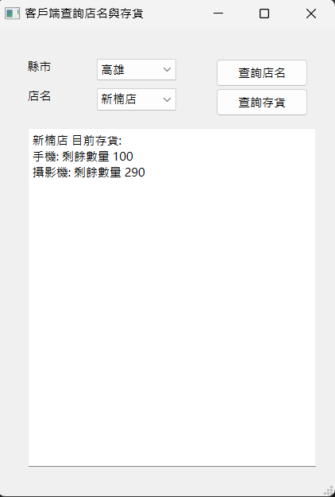
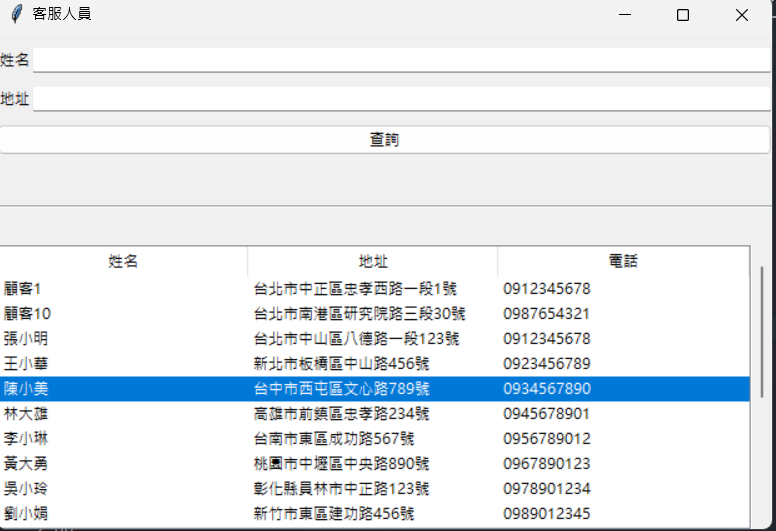
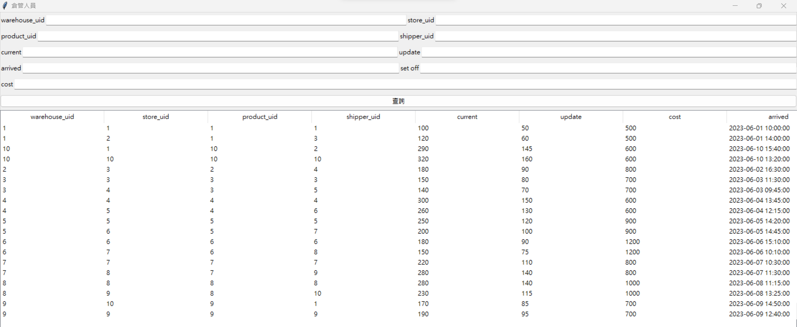

<h1>簡介</h1>

此為高師大軟體系二年級 411077016-張竣翔 與 軟體系二年級 411077028-李泓逸 的資料庫期末報告。

<h1>ER圖</h1>

<h1>schema</h1>
<a href = "https://github.com/ian5030560/database/blob/main/prepare/db/schema.sql">schema.sql</a>
<h1>query</h1>
<li>1. Find the customer who has bought the most (by price) in the past year.</li>

<li>2. Find the top 2 products by dollar-amount sold in the past year.</li>

<li>3. Find those products that are out-of-stock at every store in Kaohsiung.</li>

<li>4. Find those packages that were not delivered within the promised time.</li>

<li>5. Assume the package shipped by USPS with tracking number 123456 is reported to have been destroyed in an accident. 
Find the contact information for the customer. Also, find the contents of that shipment and create a new shipment of replacement items.
</li>

<h1>app</h1>

分別對顧客、客服人員、倉庫管理員所做的app

<h3><li>顧客</li></h3>

<h3><li>客服人員</li></h3>

<h3><li>倉庫管理員</li></h3>

